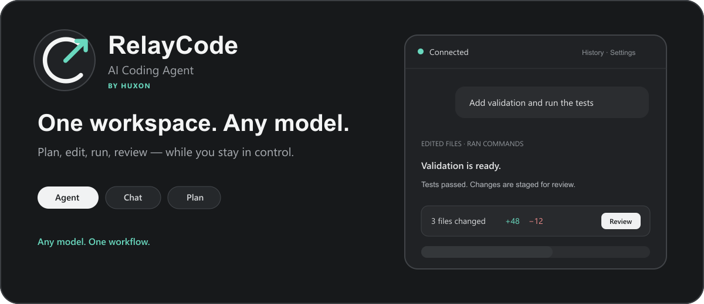
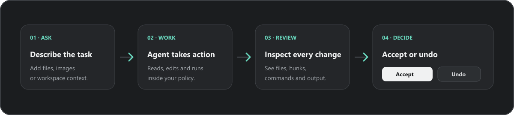

<div align="center">
  
  <br><br>
  <strong>An AI coding workspace for VS Code and Antigravity — built around your models, your tools and your approval.</strong>
  <br><br>
  <sub>A product by <strong>Huxon</strong></sub>
  <br><br>
  <a href="https://github.com/hungson1002/RelayCode/blob/main/README.md">English</a> · <a href="https://github.com/hungson1002/RelayCode/blob/main/README.vi.md">Tiếng Việt</a>
</div>

---

## What is RelayCode?

RelayCode by **Huxon** brings **Agent**, **Chat** and **Plan** workflows into one focused sidebar. Connect a cloud API, a local model or 9Router; give the Agent a task; watch its terminal and tool activity; then review every file before accepting it.

It is designed for developers who want a model-agnostic coding agent without giving up visibility or control.

<p align="center">
  
</p>

## Highlights

| Area | What you get |
| --- | --- |
| **Agent, Chat & Plan** | Use Agent for workspace tasks, Chat for direct questions and Plan for a review-first approach. |
| **Any model source** | 9Router, Cockpit Tools, OpenAI, Anthropic Claude, OpenAI-compatible APIs, Ollama and LM Studio. |
| **Visible execution** | Follow commands, terminal output, tool calls and task progress directly in the conversation. |
| **Reviewable edits** | Inspect changed files and individual hunks, then Accept or Undo per file, task or change set. |
| **Approval policies** | Ask for approval, allow edits or enable Full access with an explicit confirmation. |
| **Safer runs** | Workspace Trust, command policies, lazy Git checkpoints and reviewable changes. |
| **MCP tools** | Connect supported services through OAuth, API keys, HTTP or local stdio MCP servers. |
| **Model health** | Check which models respond, keep favorites and configure confirmed fallback routing. |
| **Usage visibility** | Inspect tokens, estimated cost, latency and available rate-limit headers. |
| **Agent image generation** | Discover image models, generate PNG/JPEG/WebP assets and review or undo the resulting file. |
| **Persistent workspace** | Chat history, pending reviews, task recovery, profiles and diagnostics survive reloads. |
| **English & Vietnamese** | Change the interface language from the extension settings panel. |

## Supported providers

| Provider | Authentication | Default endpoint |
| --- | --- | --- |
| 9Router | API key | `http://localhost:20128/v1` |
| Cockpit Tools | Client Key | `http://127.0.0.1:1455/v1` |
| OpenAI | API key | Official OpenAI API |
| Anthropic Claude | API key | Anthropic Messages API |
| OpenAI-compatible | Depends on the provider | Your custom endpoint |
| Ollama | None by default | `http://localhost:11434/v1` |
| LM Studio | None by default | `http://localhost:1234/v1` |

Local providers do not normally require an API key, but their local server must be running and a model must be downloaded.

Image generation is available in **Agent** mode when the active provider implements the OpenAI-compatible `/images/generations` endpoint. **Chat** mode remains model-only and never runs tools or commands.

## Install

### From a release

1. Download `relaycode-1.0.0.vsix` from the [RelayCode releases page](https://github.com/hungson1002/RelayCode/releases).
2. Open VS Code or Antigravity.
3. Run **Extensions: Install from VSIX…** from the Command Palette.
4. Select the downloaded file and reload the IDE.

### From source

```powershell
git clone https://github.com/hungson1002/RelayCode.git
cd RelayCode
npm install
npm run check
```

Press `F5` to open an Extension Development Host.

## First connection

1. Open the **RelayCode** icon in the Activity Bar.
2. Select **Settings**.
3. Choose a provider or create a provider profile.
4. Enter the endpoint and API key when required.
5. Save, select a model and send a small test prompt.

For 9Router, RelayCode can detect the local service, offer to install it, start it without a separate terminal and open its management page in your browser.

For Cockpit Tools, enable **API Service**, create a **Client Key**, then select Cockpit in RelayCode. RelayCode discovers models through Cockpit's local OpenAI-compatible gateway; it never reads Cockpit account credentials.

## Working with the Agent

The composer supports files, pasted images and quick workspace context:

```text
@selection
@file:path/to/file.ts
@folder:path/to/folder
@terminal
@git-diff
@problems
```

Type `$` to search installed agent skills. RelayCode discovers standard `SKILL.md` packages from `.agents/skills` in the workspace and `~/.agents/skills` for the user. A skill's full instructions are loaded only when you mention it, for example:

```text
$design-frontend Build a polished landing page in plain HTML and CSS.
```

RelayCode also reads global and project-scoped `AGENTS.md` files, including the closest applicable file for the active editor.

Useful slash commands:

```text
/goal <outcome>
/new
/compact
/skills
/model
/plan
/review
/status
/diagnostics
/mcp
/settings
/logs
/export
```

After a task, RelayCode shows the number of changed files and total additions/removals. Use **Review** for the full diff or individual hunks, then choose **Accept** or **Undo**. Undoing a newly created file removes that file.

Agent sessions retain recent turns, so follow-ups such as “continue” preserve the current task context. While a provider is silent, the activity timeline shows elapsed wait time; the inactivity limit is configurable with `nineRouter.agentInactivityTimeoutSeconds`.

## Permissions and safety

RelayCode offers three approval levels:

- **Ask for approval** — confirm actions before the Agent performs them.
- **Allow edits** — permit workspace edits while retaining safeguards for riskier operations.
- **Full access** — allow file edits and commands without repeated prompts. Enabling it always requires confirmation.

Important safeguards:

- VS Code Workspace Trust is required for Agent, terminal and MCP execution.
- A deny list blocks configured destructive command fragments even in Full access.
- Git repositories receive a background checkpoint immediately before the first file mutation when possible.
- Pending changes stay reviewable and can be recovered after an IDE reload.
- Provider and MCP credentials are stored in VS Code `SecretStorage`.

## MCP

MCP lets the Agent work with external tools such as design systems, issue trackers, documentation, browsers and databases.

RelayCode supports:

- Browser OAuth when the MCP server allows dynamic client registration.
- API-key and bearer-token authentication.
- Streamable HTTP MCP servers.
- Local stdio MCP servers with separately stored environment secrets.

Some providers restrict OAuth to approved applications. In those cases, use the provider's desktop MCP server, API-key flow or a manually registered OAuth application.

## Privacy

- RelayCode does not operate an analytics service.
- Prompts and selected context are sent only to the active provider.
- MCP input is sent only to MCP servers you configured.
- Credentials are kept in `SecretStorage` and excluded from diagnostics.
- Chat history, telemetry and pending reviews remain on the local machine.

Read the complete policy in <a href="https://github.com/hungson1002/RelayCode/blob/main/PRIVACY.md">PRIVACY.md</a>.

## Current limitations

- Cloud cost estimates require input/output prices in the provider profile.
- Model checks make a minimal request and may consume quota.
- OAuth availability depends on each MCP provider's authorization policy.
- Agent quality and tool support vary by model.

## Development

```powershell
npm install
npm run typecheck
npm test
npm run build
npm run package
```

The project currently requires Node.js 20+ and VS Code 1.100+.

## License

<a href="https://github.com/hungson1002/RelayCode/blob/main/LICENSE">MIT</a>
